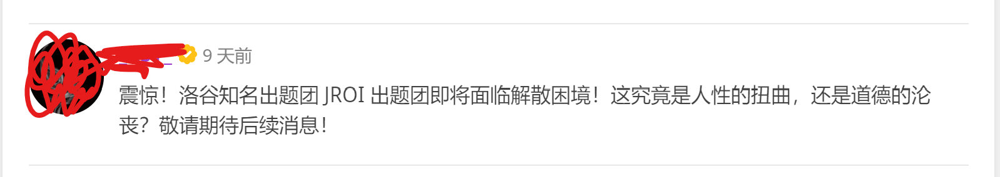

# 【LGR-124】洛谷 10 月 CSP-J 模拟赛 & JROI R8

一场比赛需要一张头图。



本场比赛为【LGR-124】洛谷 10 月 CSP-J 模拟赛 & JROI R8，简称 LGR-124。

**本场月赛为 普及组 Round。**

本场比赛时间为 2022 年 10 月 23 日，上午 8:30 ~ 12:00，为正式比赛的相同时间。考虑到临近 CSP-2022，本场比赛的难度更接近于入门组真实难度。比赛采用 OI 赛制，知识点符合 NOI 大纲的相关要求。

**因为我们比赛的时候改动不了比赛界面，因此设置 [公告云剪贴板](https://www.luogu.com.cn/paste/xal01ygb)，请您随时查看。**

## 直播讲解

比赛赛后将提供直播视频讲解，主讲人为 [45dino](https://www.luogu.com.cn/user/240812)

时间：10 月 23 日（比赛当日）19 时

题解在比赛结束后向报名讲评的同学先行公开，题解通道将于赛后 3 日开放。

购票上车/观看讲评地址：[https://class.luogu.com.cn/course/](https://class.luogu.com.cn/course/)

## 相关事项

1.  本场比赛有 4 道题目，**为 OI 赛制**，OI 赛制以最后一次提交为准。
    
2.  本次比赛计入 Rating，根据比赛成绩进行积分，影响咕值。
    
3.  严禁开小号/和他人分享答案以达成任何目的，或者直接套用非本人编写的代码。本次比赛将使用反作弊系统，因为任何原因被反作弊系统发现（包括多人套用同一个互联网公开的代码）、被举报或在抽查代码时发现选手有影响比赛成绩公平性的行为，视情节严重性给予取消成绩、警告性棕名或者封号的处罚。
    
4.  **如果发现比赛有原题或其他影响公平性的因素，请私聊管理员和出题人，而不要以任何方式公开，违者视影响可能会得到警告性棕名或禁言的惩罚。**
    
5.  知乎评价链接：[https://www.zhihu.com/question/559492020](https://www.zhihu.com/question/559492020)。

# 『JROI-8』雷雨天特别行动科

## 题目背景


>“天使可没有假期”\
“啊，又来了……还是不要勉强自己会比较好哦”

**已获得转载授权。**

## 题目描述

对于**非负整数**变量 $x$，记以下为一轮操作：

1. 将 $x$ 增加 $1$；
2. 如果 $x$ 是 $3$ 的倍数，则将 $x$ 除以 $3$。

给定初始的 $x,k$，试求 $k$ 轮操作后 $x$ 的值。

**请注意，大样例不以文件附加形式给出，而直接放在题目的 输入输出样例 中的 样例 #3**

## 输入格式

一行两个非负整数 $x,k$。

## 输出格式

一行一个正整数，表示 $k$ 轮操作后 $x$ 的值。

## 样例 #1

### 样例输入 #1

```
1 3
```

### 样例输出 #1

```
2
```

## 样例 #2

### 样例输入 #2

```
10 3
```

### 样例输出 #2

```
5
```

## 样例 #3

### 样例输入 #3

```
1919810 3
```

### 样例输出 #3

```
213313
```

## 提示

【样例解释】

对于样例一， $x$ 的变化过程如下：$1\rightarrow 2\rightarrow (3\rightarrow 1)\rightarrow 2$。

其中括号内为一次操作。

【数据范围与提示】

对于全部的测试数据，满足 $0\leq x,k\leq 10^{18}$。

**特别的，第 $1\sim 2$ 测试点中的 $k\leq 0$ 等价于 $k=0$，$3\sim 4$ 的 $x$ 同理**。

|    测试点编号 | 分数 |   $x\leq$ |   $k\leq$ |
| ----------: | ---: | --------: | --------: |
|   $1\sim 2$ | $20$ |       $5$ |       $0$ |
|   $3\sim 4$ | $20$ |       $0$ | $10^{18}$ |
|   $5\sim 6$ | $20$ | $10^{18}$ |    $10^6$ |
| $7 \sim 10$ | $40$ | $10^{18}$ | $10^{18}$ |

# 『JROI-8』对了，还有花，少女，银河

## 题目背景


>「其一」\
即使化身白骨，也有不想忘记的东西

**已获得转载授权。**

## 题目描述

给定 $n$，请构造一个长度为 $n$ 的仅包含 $0,1$ 的数字串，满足 $01,00,10,11$ 出现的次数相等。或报告无解。

这里“出现”指与原字符串中连续的一部分完全相同。例如，在 $1011101$ 中，$01,00,10,11$ 分别出现了 $2,0,2,2$ 次。

**请注意，大样例不以文件附加形式给出，而直接放在题目的 输入输出样例 中的 样例 #3**

## 输入格式

一行一个正整数 $n$。

## 输出格式

若有解，输出一行一个长度为 $n$ 的满足条件的仅包含 $0,1$ 的数字串。

若无解，输出 `-1`。

## 样例 #1

### 样例输入 #1

```
3
```

### 样例输出 #1

```
-1
```

## 样例 #2

### 样例输入 #2

```
5
```

### 样例输出 #2

```
00110
```

## 样例 #3

### 样例输入 #3

```
15400
```

### 样例输出 #3

```
-1
```

## 提示

【数据范围与提示】

|    测试点编号 | 分数 | $n\leq$ |         特殊性质 |
| ----------: | ---: | ------: | --------------: |
|   $1\sim 2$ | $20$ |     $5$ |               无 |
|   $3\sim 4$ | $20$ |  $10^6$ | $n \bmod 4 = 0$ |
|   $5\sim 6$ | $20$ |    $20$ |               无 |
| $7 \sim 10$ | $40$ |  $10^6$ |               无 |

# 『JROI-8』这是新历的朝阳，也是旧历的残阳

## 题目背景


>少女于海边伫立，凝视着落日最后的余晖\
“已然过去了呢，旧历的一年......”

**已获得转载授权。**

## 题目描述

给定序列 $\{a_n\}$，满足每一项都不小于前一项。对于所有不超过 $k$ 的正整数 $m$，询问如果将 $a$ 分成 $m$ 段（可以有空段），并给从前往后第 $i$ 段内的每个数都加上 $i$，增加后的 $\sum\limits_{j=1}^n a_j^2$ 最大是多少。询问相互独立，即每次询问时给每个数加的值不保留到下一次询问。

例如，对于序列 $\{-3,1,2,2\}$，若 $m=5$，则一种分段方式是 $[-3][][1,2][][2]$，增加后的序列是 $-2,4,5,7$，此时 $\sum\limits_{j=1}^n a_j^2=94$。

记 $m=i$ 时的答案（即此时最大的 $\sum\limits_{j=1}^n a_j^2$）为 $q_i$，出于良心考虑，你只需要输出 $\left(\sum\limits_{i=1}^k q_i\right) \bmod 998244353$ 即可。标准程序不基于特殊的输出方式，即能独立求出每一个 $q_i$。

## 输入格式

第一行两个正整数 $n,k$，同题意。

接下来一行 $n$ 个整数，表示 $\{a_n\}$。

## 输出格式

一行一个整数，表示 $\left(\sum\limits_{i=1}^k q_i\right) \bmod 998244353$。

## 样例 #1

### 样例输入 #1

```
4 3
-3 1 2 2
```

### 样例输出 #1

```
141
```

## 提示

#### 【样例解释】

当 $m=1$ 时，最优策略是 $[-3,1,2,2]$，$q_1=(-2)^2+2^2+3^2+3^2=26$。

当 $m=2$ 时，最优策略是 $[-3][1,2,2]$，$q_2=(-2)^2+3^2+4^2+4^2=45$。

当 $m=3$ 时，最优策略是 $[-3][][1,2,2]$，$q_3=(-2)^2+4^2+5^2+5^2=70$。

则 $\left(\sum\limits_{i=1}^k q_i\right) \bmod 998244353=(q_1+q_2+q_3)\bmod 998244353=(26+45+70)\bmod 998244353=141$。

#### 【数据范围与约束】

|    测试点编号 | 分数 | $n\leq$ | $k\leq$ | $\lvert a_i\rvert \leq$ |    特殊性质 |
| ----------: | ---: | ------: | ------: | ----------------------: | ---------: |
|   $1\sim 3$ | $15$ |    $12$ |    $12$ |                  $1000$ |          无 |
|   $4\sim 6$ | $15$ |  $1000$ |  $1000$ |                  $1000$ |          无 |
|   $7\sim 8$ | $10$ |  $10^6$ |  $10^6$ |                  $10^7$ | $a_i\geq0$ |
| $9 \sim 12$ | $20$ |  $10^6$ |  $1000$ |                  $10^7$ |          无 |
| $13\sim 20$ | $40$ |  $10^6$ |  $10^7$ |                  $10^7$ |          无 |

# 『JROI-8』颅脑损伤 2.0

## 题目描述

给定 $n$ 条线段，第 $i$ 条是 $[l_i,r_i]$。将每一条线段染成红色或黑色，要求：

1. 任意两条红色线段不相交。
2. 任意一条黑色线段**至少**和一条红色线段相交。

请最小化红色线段的长度和，并输出这个长度和。

一条线段 $[l_i,r_i]$ 的长度定义为 $r_i-l_i$，两条线段 $[l_i,r_i],[l_j,r_j]$ 交**当且仅当** $l_i\le r_j$ 且 $l_j\le r_i$。

## 输入格式

第一行一行一个正整数，代表 $n$。

接下来 $n$ 行，每行两个整数，代表 $l_i,r_i$，用空格隔开。

## 输出格式

一行一个非负整数，代表红色线段的长度和的最小值。

## 样例 #1

### 样例输入 #1

```
5
-6 5
1 3
-4 9
-1 10
6 8
```

### 样例输出 #1

```
4
```

## 提示

**数据范围**

|测试点编号|$n\le$|
| :----------: | :----------: |
|$1\sim4$|$10$|
|$5\sim8$|$400$|
|$9\sim20$|$3000$|

对于所有数据，满足 $-10^9\le l_i<r_i\le10^9$。

# 我的做题记录

[比赛链接](https://www.luogu.com.cn/contest/82487)

|               [题目列表](https://www.luogu.com.cn/contest/82487#problems)                | [排行榜](https://www.luogu.com.cn/contest/82487#scoreboard) |
| :-------------------------------------------------------------------------------------: | :---------------------------------------------------------: |
|       [雷雨天特别行动科](https://www.luogu.com.cn/problem/T270955?contestId=82487)        |     [T1评测](https://www.luogu.com.cn/record/91099209)      |
|    [对了，还有花，少女，银河](https://www.luogu.com.cn/problem/T240619?contestId=82487)    |     [T2评测](https://www.luogu.com.cn/record/91112429)      |
| [这是新历的朝阳，也是旧历的残阳](https://www.luogu.com.cn/problem/T270945?contestId=82487) |     [T3评测](https://www.luogu.com.cn/record/91126861)      |
|         [颅脑损伤 2.0](https://www.luogu.com.cn/problem/T241379?contestId=82487)         |     [T4评测](https://www.luogu.com.cn/record/91136009)      |