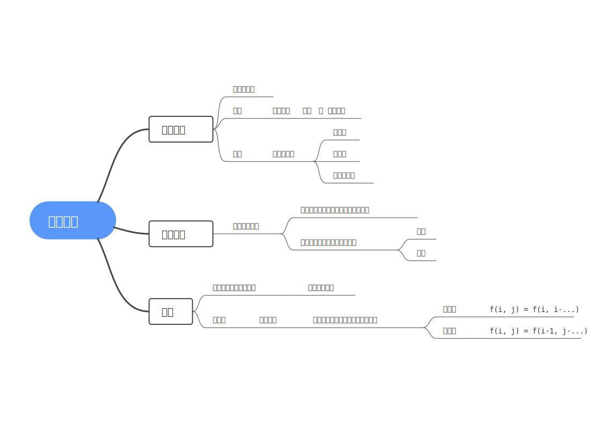

# 动态规划问题
>[DP分析](https://www.acwing.com/file_system/file/content/whole/index/content/2630675/)
1. 状态表示 $f_{\dots}$ 用几维表示状态、含义？
   * 集合（$f_{i,j}$ 的集合）：满足某些 **条件** 的 **所有选法**
   * 属性（$f_{i,j}$ 的值）：集合的 { 最大值 / 最小值 / 元素的数量 }（求解的目标）
2. 状态计算 $--$ 每一步状态的计算，集合如何划分？
   * 把集合 $f_{\dots}$ 划分为若干个可以计算的子集
   * 每一个元素出现且仅出现一次（不重 不漏）
3. 时间复杂度 = 状态数量*转移计算量
4. 在能求出答案的情况下，维度越小越好
5. 与前面已经计算过的数据建立关系
6. 考虑上一步分类

## 优化
* 代码或方程的等价变形（时间优化）
   相似方程合并，三维转二维
* 一维化（空间优化）
   滚动数组，看准第二维度是正循环还是反循环（如果是 $f_{\boldsymbol i,j-?}$ 就是正循环，$f_{\boldsymbol{i-1},j-?}$ 就是反循环）
* 二进制优化
   把多重背包转换为01背包
   
