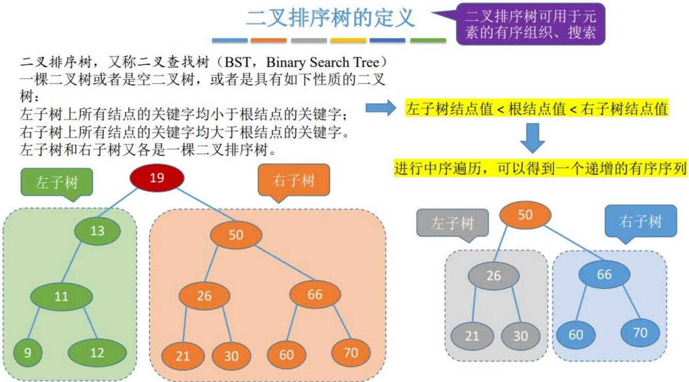
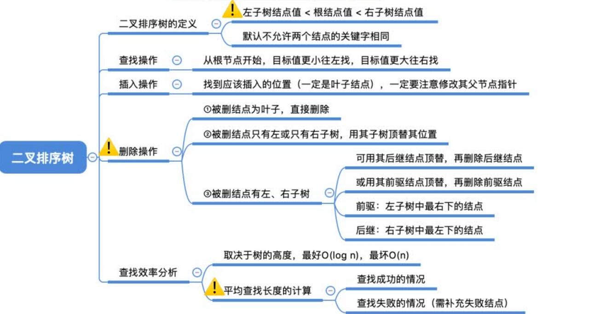

# 二叉排序树
## 详解见：[二叉排序树的基本概念总结整理.html](二叉排序树的基本概念总结整理.html)

## 定义
二叉树，左子树结点值＜根结点值＜右子树结点值，<mark>二叉排序树中不能存在有值相同的结点！</mark>

|            二叉排序树            |  左子树和右子树各是一棵二叉排序树  |
| :-----------------------------: | :-----------------------------: |
| 左子树上的所有节点的值＜根节点的值 | 右子树上的所有结点的值＞根节点的值 |


## 性质
对一棵二叉排序树进行中序遍历，可以得到一个递增的有序序列
## 代码实现
### 定义
```cpp
// 定义
typedef struct BSTNode
{
	int key;	// 结点的值
	struct BSTNode
		*lchild,	// 指针存储左子树
		*rchild;	// 指针存储右子树
} BSTNode, *BSTree;
```
### 查找
若树非空，目标值与根节点的值比较：
* 相等：查找成功
* 小于根节点：在左子树上查找
* 否则：在右子树上查找

查找成功，返回结点指针；查找失败，返回NULL。
#### 循环实现
```cpp
// 在二叉树中查找值为 key 的结点（循环实现）
BSTNode *BST_Search(BSTree T, int key)
{
	// 若树空或等于要查找的值，循环停止
	while ((T != NULL) && (T->key != key))
		if (key < T->key)	// key比这一节点小，则在左子树上查找
			T = T->lchild;
		else				// key比这一节点大，则在右子树上查找
			T = T->rchild;
	return T;
}
```
#### 递归实现
```cpp
// 在二叉树中查找值为 key 的结点（递归实现）
BSTNode *BST_Search_rec(BSTree T, int key)
{
	if (T == NULL)		// 查找失败
		return NULL;
	if (key == T->key)	// 查找成果
		return T;
	if (key < T->key)	// key 比这一节点小，则在左子树上查找
		return BST_Search_rec(T->lchild, key);
	else				// key 比这一节点大，则在右子树上查找
		return BST_Search_rec(T->rchild, key);
}
```
### 插入
* 原二叉树为空：直接插入结点
* 值k小于根节点值：插入到左子树
* 值k大于根节点值：插入到右子树
#### 递归实现
```cpp
// 在二叉排序树中插入值为 k 的新节点
bool BST_Insert(BSTree &T, int k)
{
	if (T == NULL)	// 原树为空，新插入的结点为根节点
	{
		T = (BSTree)malloc(sizeof(BSTNode));
		T->key = k;
		T->lchild = T->rchild = NULL;
		return true;	// 插入成功，返回TRUE
	}
	if (k == T->key)	// 树中存在相同值的结点，插入失败
		return false;
	if (k < T->key)	// k小于根节点值，插入到左子树
		return BST_Insert(T->lchild, k);
	else				// k大于根节点值，插入到右子树
		return BST_Insert(T->rchild, k);
}
```
### 构造
依次将每个值插入到二叉排序树中
```cpp
// 按照 p[] 中的值序列建立二叉排序树
void Creat_BST(BSTree &T, int p[], int n)
{
	T = NULL;							// 初始化T为空树
	for (int i = 0 ; i < n ; ++i)	// 依次将每个值插入到二叉排序树中
		BST_Insert(T, p[i]);
}
```
### 删除
每次删除操作一定存在四种情况：
1. 待删除的结点既没有左子树，也没有右子树，直接删除该结点。
2. 待删除的结点只有左子树，直接删除该结点，把左子树接上待删除结点的父节点。
3. 待删除的结点只有右子树，直接删除该结点，把右子树接上待删除结点的父节点。
4. 待删除的结点既有左子树又有右子树，这个比上两个情况麻烦一点。待删除结点的左子树的最右下角的结点满足【小于 $x$ 并且最接近 $x$】用这个结点覆盖待删除的结点，然后把这个结点删除。
#### 代码实现
```cpp
// 在二叉排序树中删除值为 k 的结点
bool BST_Erase(BSTree &T, int k)
{
	BSTNode *node = BST_Search(T, k);
	if (node != NULL)
	{
		if ((node->lchild == NULL) && (node->rchild == NULL))// 待删除的结点既没有左子树，也没有右子树
			node = NULL;			// 直接删除该结点
		else if (node->rchild == NULL)							// 待删除的结点只有左子树
			node = node->lchild;	// 把左子树接上待删除结点的父节点
		else if (node->lchild == NULL)							// 待删除的结点只有右子树
			node = node->rchild;	// 把右子树接上待删除结点的父节点
		else
		{
			BSTNode *p = node->lchild;
			while (p->rchild != NULL)
				p = p->rchild;
			node->key = p->key;
			BST_Erase(node->lchild, p->key);
		}
	}
	return false;
}
```
## 总结
