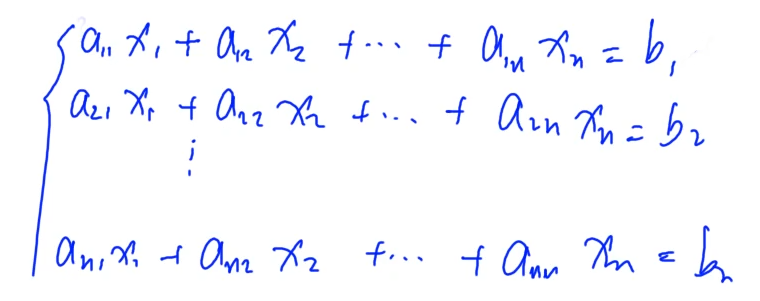
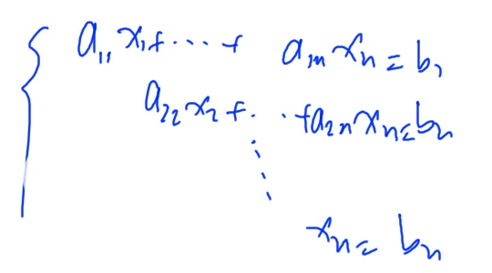

# 高斯消元

> 时间复杂度：$O(n^3)$
>
> 

## 解的情况

1. 无解
2. 无穷组解
3. 唯一解

## 初等行列变换

对**系数矩阵**进行 *初等行列变换* 的操作（变换为 **最简*****阶梯矩阵***——一个上三角的形式）

1. 把每一行乘上一个非零的数（等同于：*等式两边同时乘以一个相同的非零数*）

2. 交换某两行（等同于：*交换某两个方程*）

3. 把某行的若干倍加到另一行上去（等同于：*把一个方程加到另一个方程上去*）

> 这三种变换不会影响方程组的解（等价变换）
>
> **这三种操作称为“初等行列变换”**

## 最简阶梯矩阵

> @原始矩阵：


> @目标矩阵（最简阶梯矩阵）：


> @THEN：
> $x_n$ 可以直接求出来
> 向上推出来所有未知数的值

## 解的情况判断

1. 完美阶梯型：唯一解

2. 非完美阶梯型——左边没有未知数，右边系数非零：无解

3. 否则：无穷组解

## 高斯消元

1. 枚举每一列

   1. 找到这一列中，**绝对值最大的行**（可以减小精度误差）

   2. 把这一行**换到最上面**
   3. 将这一行的第一个数变成 $1$（**每个数同时除以第一个数**）
   4. 把这一列，除了第一个数，全都消成零（**加上这一行的倍数**）
   5. **固定这个方程（以后不再考虑）**

2. 重复以上操作

## 代码
```cpp
#include <iostream>
#include <algorithm>
#include <cmath>

using namespace std;

const int N = 110;
const double eps = 1e-7;

int n;
double a[N][N];

int gauss()
{
	int c, r;
	for (c = 0, r = 0 ; c < n ; ++c)
	{
		int t = r;
		for (int i = r ; i < n ; ++i)
			if (fabs(a[i][c]) > fabs(a[t][c]))
				t = i;

		if (fabs(a[t][c]) < eps)
			continue;

		for (int i = c ; i <= n ; ++i)
			swap(a[t][i], a[r][i]);
		for (int i = n ; i >= c ; --i)
			a[r][i] /= a[r][c];
		for (int i = r + 1 ; i < n ; ++i)
			if (fabs(a[i][c]) > eps)
				for (int j = n ; j >= c ; --j)
					a[i][j] -= a[r][j] * a[i][c];

		++r;
	}

	if (r < n)
	{
		for (int i = r ; i < n ; ++i)
			if (fabs(a[i][n]) > eps)
				return 2;
		return 1;
	}

	for (int i = n - 1 ; i >= 0 ; --i)
		for (int j = i + 1 ; j < n ; ++j)
			a[i][n] -= a[i][j] * a[j][n];

	return 0;
}

int main()
{
	cin >> n;
	for (int i = 0 ; i < n ; ++i)
		for (int j = 0 ; j < n + 1 ; ++j)
			cin >> a[i][j];

	int t = gauss();
	switch (t)
	{
		case 0:
		{
			for (int i = 0 ; i < n ; ++i)
			{
				if (fabs(a[i][n]) < eps)
					a[i][n] = 0.00;
				printf("%.2lf\n", a[i][n]);
			}
			break;
		}
		case 1:
		{
			printf("Infinite group solutions\n");
			break;
		}
		default:
		{
			printf("No solution\n");
			break;
		}
	}

	return 0;
}
```

## P3389 高斯消元法
```cpp
#include <iostream>
#include <algorithm>
#include <cmath>

using namespace std;

const int N = 110;
const double eps = 1e-8;

int n;
double a[N][N];

bool gauss()
{
	int c, r;
	for (c = 0, r = 0 ; c < n ; ++c)
	{
		int t = r;
		for (int i = r ; i < n ; ++i)
			if (fabs(a[i][c]) > fabs(a[t][c]))
				t = i;

		if (fabs(a[t][c]) < eps)
			continue;

		for (int i = c ; i <= n ; ++i)
			swap(a[t][i], a[r][i]);
		for (int i = n ; i >= c ; --i)
			a[r][i] /= a[r][c];
		for (int i = r + 1 ; i < n ; ++i)
			if (fabs(a[i][c]) > eps)
				for (int j = n ; j >= c ; --j)
					a[i][j] -= a[r][j] * a[i][c];

		++r;
	}

	if (r < n)
		return false;

	for (int i = n - 1 ; i >= 0 ; --i)
		for (int j = i + 1 ; j < n ; ++j)
			a[i][n] -= a[i][j] * a[j][n];

	return true;
}

int main()
{
	cin >> n;
	for (int i = 0 ; i < n ; ++i)
		for (int j = 0 ; j < n + 1 ; ++j)
			cin >> a[i][j];

	if (gauss())
	{
		for (int i = 0 ; i < n ; ++i)
		{
			if (fabs(a[i][n]) < eps)
				a[i][n] = 0.00;
			printf("%.2lf\n", a[i][n]);
		}
	}
	else
		printf("No Solution\n");
	return 0;
}
```

## 异或线性方程组
```cpp
#include <iostream>
#include <algorithm>
#include <cmath>

using namespace std;

const int N = 110;

int n;
int a[N][N];

int gauss()
{
	int r, c;
	for (r = c = 0 ; c < n ; ++c)
	{
		int t = r;
		for (int i = r ; i < n ; ++i)
			if (a[i][c])
			{
				t = i;
				break;
			}

		if (!a[t][c])
			continue;

		for (int i = c ; i <= n ; ++i)
			swap(a[t][i], a[r][i]);

		for (int i = r + 1 ; i < n ; ++i)
			if (a[i][c])
				for (int j = c ; j <= n ; ++j)
					a[i][j] ^= a[r][j];

		++r;
	}

	if (r < n)
	{
		for (int i = r ; i < n ; ++i)
			if (a[i][n])
				return 2;
		return 1;
	}

	for (int i = n - 1 ; i >= 0 ; --i)
		for (int j = i + 1 ; j < n ; ++j)
			a[i][n] ^= a[i][j] & a[j][n];

	return 0;
}

int main()
{
	cin >> n;
	for (int i = 0 ; i < n ; ++i)
		for (int j = 0 ; j < n + 1 ; ++j)
			cin >> a[i][j];

	int t = gauss();

	switch (t)
	{
		case 0:
		{
			for (int i = 0 ; i < n ; ++i)
				printf("%d\n", a[i][n]);
			break;
		}
		case 1:
		{
			printf("Multiple sets of solutions\n");
			break;
		}
		default:
		{
			printf("No solution\n");
			break;
		}
	}

	return 0;
}
```