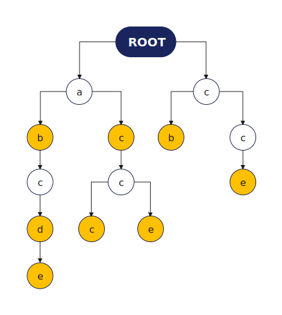

# Trie树

#### 定义
高效地存储和查找字符串集合的数据结构
#### 作用
存储和查找字符串集合
#### 结构

从前往后遍历每一个字符
没有这个子节点，就创建一个子节点

#### 代码
```cpp
#include<cstdio>
#include<iostream>

using namespace std;

const int N = 1e5 + 10;

// 下标是0的点，即使根节点，又是空节点
// son[][]存储树中每个节点的子节点
// cnt[]存储以每个节点结尾的单词数量
int son[N][26], cnt[N], idx;
char str[N];

// 插入一个字符串
void insert(char str[])
{
	int p = 0;
	for (int i = 0 ; str[i] ; ++i)
	{
		int u = str[i] - 'a';
		if (!son[p][u])
			son[p][u] = ++idx;
		p = son[p][u];
	}
	++cnt[p];
}

// 查询字符串出现的次数
int query(char str[])
{
	int p = 0;
	for (int i = 0 ; str[i] ; ++i)
	{
		int u = str[i] - 'a';
		if (!son[p][u])
			return 0;
		p = son[p][u];
	}

	return cnt[p];
}

int main()
{
	int n;
	scanf("%d", &n);

	while (n--)
	{
		char op[2];
		scanf("%s%s", op, str);
		if (op[0] == 'I')
			insert(str);
		else
			printf("%d\n", query(str));
	}

	return 0;
}
```